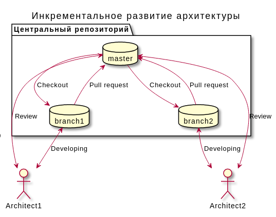
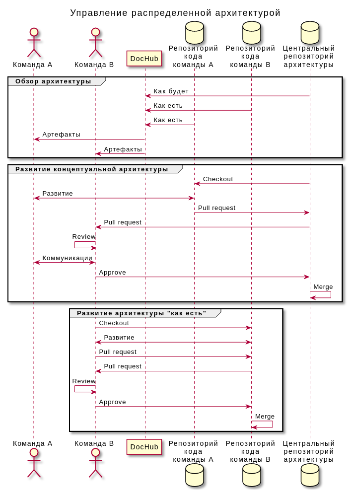
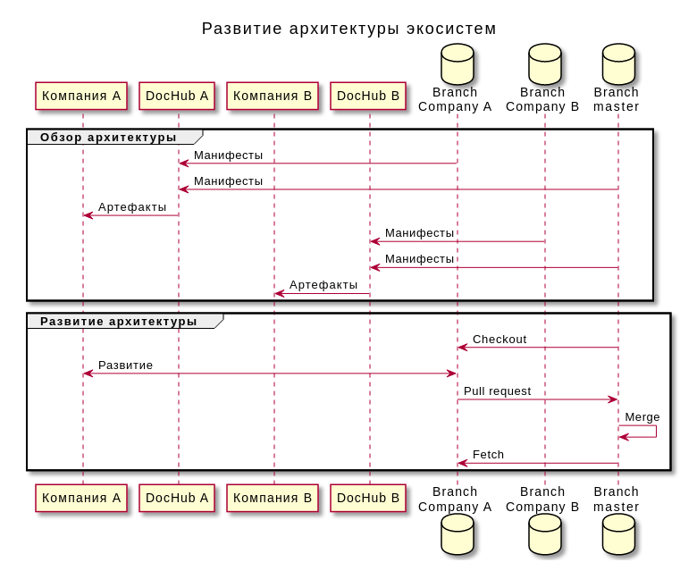
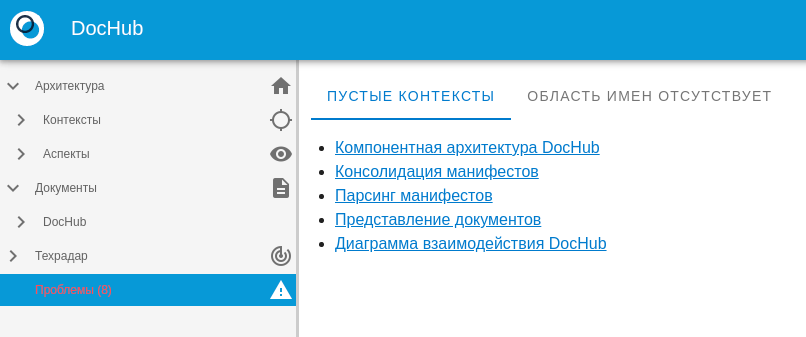
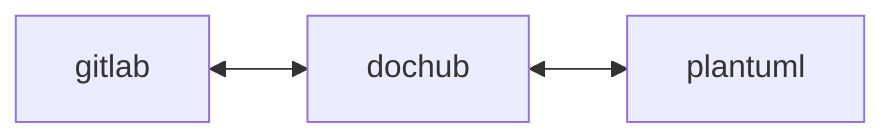

# DocHub

Dochub is ArchOps tool. Dochub allows describing architecture as a code.

Dochub supports:

* [PlantUML](https://plantuml.com/)
* [Markdown](https://ru.wikipedia.org/wiki/Markdown)
* [Swagger](https://swagger.io/)
* [Manifests](https://dochub.info/docs/dochub_contexts)


## Features

Dochub allows solves issues with:

* [Versioning Architecture](#versioning);
* [Decentralized architecture management in Agile-oriented companies](#decentralized);
* [Ecosystem Architecture Management](#ecosystem);
* [Unified portal of documentations](#facade);
* [Consistency control](#problems).

### <a name="versioning"></a> Versioning Architecture

Dochub provides to manage architecture using Git. 



### <a name="decentralized"></a> Decentralized architecture management in Agile-oriented companies

DocHub can use external git repositories as external sources.
It allows developing different parts of big project with several teams.




## <a name="ecosystem"></a> Ecosystem architecture management

DocHub is built with today's challenges in ecosystem architecture management in mind. In it, the products are interconnected,
but develop autonomously. DocHub allows you to create a single information space for the ecosystem. Stimulates
positive product synergy.




## <a name="facade"></a> Unified portal of documentations

DocHub is the simplest way to a centralised documentation portal.


## <a name="problems"></a> Consistency control

DocHub can find problems in the description of the architecture.



## Live demo portal

https://dochub.info/

## Configure

Dochub configures with environment variables. Example available in [`example.env`](example.env). Rename it to `.env`

```bash
cp -f example.env .env
```

Define the required environment variables in `.env`

## Developing

Dochub is regular vuejs single page application (spa).

### build with docker (simple)

> Pay your attention! Docker builds can be much longer than regular npm way.

**Requirements:**

* docker >= 20
* docker-compose >= 3.8


```bash
export DOCKER_BUILDKIT=1 # or configure in daemon.json
export COMPOSE_DOCKER_CLI_BUILD=1
git clone git@github.com:RabotaRu/DocHub.git
cd DocHub
docker-compose up --build
```

### build with npm (recommended)

**Requirements:**

* nodejs >= 12
* plantuml with shade plugin


0. you can deploy plantuml with docker as an external service
```bash
docker-compose up plantuml
```
1. Configure `.env`
```dotenv
VUE_APP_DOCHUB_GITLAB_URL=https://gitlab.example.com
```
2. Install dependencies. Results will available at `./node_modules` directory.
```bash
npm install
```
2. Build SPA. Static files available at `./dist` directory.
```bash
npm run build
```
3. Serve with nodejs. Open http://localhost:8080/main in your browser.
```bash
npm run serve
```


## Deployment

You need the following components in order to work doсhub:

* Plantuml-server with shade plugin needs to render;
* Gitlab. Dochub uses gitlab as an auth. 
  * Create OAuth2 provider in your GitLab. https://docs.gitlab.com/ee/integration/oauth_provider.html.
  


You can serve dochub like regular static site via nginx, s3 or something else.

Full VueJS [documentation](https://cli.vuejs.org/ru/guide/deployment.html) about deployment.


### Kubernetes

You can use the [helm chart](https://github.com/RabotaRu/helm-charts/tree/main/charts/dochub)

## License

[GNU GPL v.2](http://www.gnu.org/licenses/old-licenses/gpl-2.0.html), see [LICENSE](LICENSE)

## Articles

* [Архитектура как кот VS Архитектура как кол](https://habr.com/ru/company/rabota/blog/578340/);
* [Архитектура как данные](https://habr.com/ru/post/593009/);


## Stargazers over time

[](https://starchart.cc/RabotaRu/DocHub)
