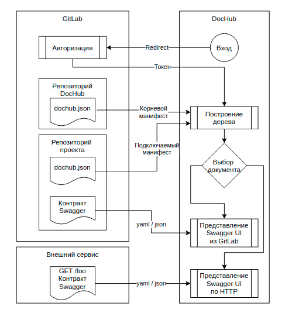
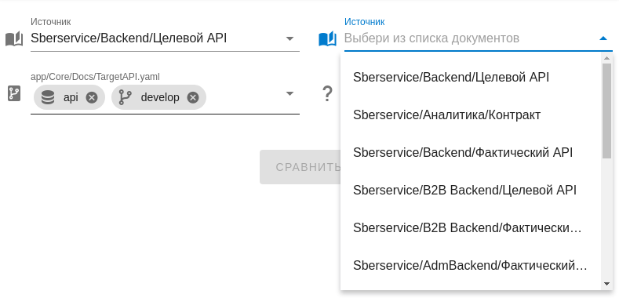
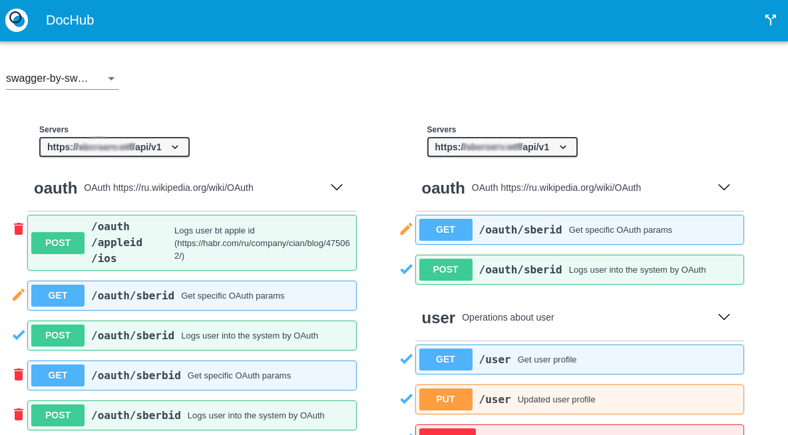
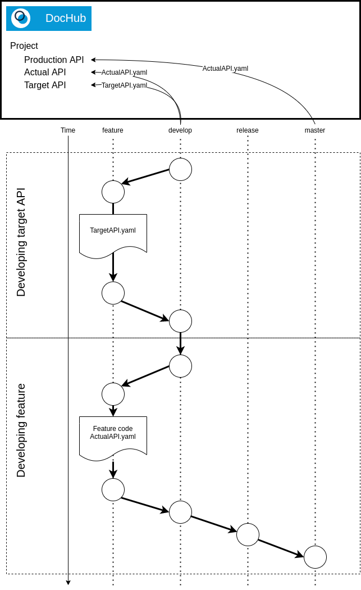

# DocHub
DocHub позволяет публиковать контракты сервисов/микросервисов Компании на едином ресурсе 
для удобной работы с ними. Контракты должны быть оформлены в нотации [Swagger](https://swagger.io/specification/).


Для хранения контрактов используется GitLab. Данная концепция реализует подход ArchOps (архитектура как код). Управление изменениями контрактов подчиняется gitflow.

Поддерживается OAuth авторизация через GitLab, что позволяет управлять доступом пользователей к документации.

Также DocHub позволяет подключать контракты внешних сервисов через http/https протокол.

## Архитектура



## Сборка

### Сборка из исходников

Проект является VueJS SPA приложением. В качестве backend пользуется GitLab. 

Для развёртывания потребуется стандартная сборка VueJS приложения средствами npm.
```
npm install
npm run build
```

В результате будут сгенерированы статические файлы в папке /dist. Их необходимо 
опубликовать используя web-сервер. Например, nginx. 

Подробнее о вариантах развертывания можно узнать [тут](https://cli.vuejs.org/ru/guide/deployment.html). 

Если вы собираетесь использовать режим разработки, проведите конфигурирование проекта:
* В папке /certs разместите ваши сертификаты;
* Модифицируйте файл vue.config.js в соответствии в вашими потребностями.

После этого выполните команды:
```
npm run serve
```

### Сборка docker

```
  docker build -t dochub .
  docker run dochub -p 8080:8080
``` 

## Конфигурирование

### Настройка GitLab

Для функционирования DocHub необходимо настроить OAuth2 service provider
в GitLab. Документацию по настройке можно найти на
[официальном сайте](https://docs.gitlab.com/ee/integration/oauth_provider.html). 


### Настройка приложения
Конфигурирование осуществляется через файл настроек src/config.json

```javascript
{
    "gitlab_server": "https://git.rabota.space", //URL gitlab,
    "root_manifest": { // Корневой манифест
        "project_id": 234, // Идентификатор проекта в gitlab
        "branch": "master" // Бранч в котором лежит актуальный корневой манифест 
    },
    "oauth" : { // Параметрый OAuth gitlab 
        "APP_ID": "5f3...2ef0",
        "CLIENT_SECRET": "1e4c4...384",
        "REQUESTED_SCOPES": "read_repository+api"
    }
}
```

### Управление контрактами

Подключение контрактов в DocHub производится на основании манифестов (специальных json файлов).
Манифест располагается в репозитории проекта публикующего свои контракты. Любой пользователь 
обладающий достаточными правами в репозитории может внести в него изменения. Таким образом 
достигается автономность управления документацией членами команды проекта. 

Для определения репозиториев публикующих контракты служит корневой манифест. В нем указывается 
расположение подключаемых манифестов. При загрузке дерева документов, сначала загружается 
корневой манифест, затем все указанные в нем манифесты проектов.

Расположение корневого манифеста указывается в настройках приложения (src/config.json). 

Пример корневого манифеста (/dochub.json):
```javascript
{
  "imports": [ // Определяет подключаемые проекты (манифесты). 
               // Файл манифеста всегда должен иметь название dochub.json 
               // и располагаться в корне репозитория.
    {
      "project_id": 106, // Идентификатор проекта в GitLab
      "branch": "develop" // Ветка в которой расположен актуальный манифест проекта
    }
  ]
}
```

Пример манифеста проекта (/dochub.json):
```javascript
{
  "docs": { // Перечисляются контракты проекта
      "sbs-targetapi": { // Уникальный идентификатор документа
          "icon": "lightbulb_outline", // Доступные иконки тут - https://materialdesignicons.com/
          "location": "Sberservice/Backend/Целевой API", // Расположение в навигационном дереве
          "description": "Целевой REST-интерфейс для бэка", // Краткое описание
          "transport" : "gitlab", // Контракт расположен в GitLab
          "project_id": 106, // Идентификатор проекта в GitLab
          "branch": "develop", // Бранс в котором расположена актуальный контракт
          "source": "app/Core/Docs/TargetAPI.yaml" // Описание контракта в нотации Swagger
      },
      "sbs-realapi": {
          "icon": "lightbulb_outline",
          "location": "Sberservice/Backend/Фактический API",
          "description": "Фактический REST-интерфейс для бэка",
          "transport" : "http", // Контракт расположен на внешнем ресурсе и доступен по http
          "source": "https://foo.site/api/v1/docs/api-docs.json"
      }
  }
}
```

* Корневой манифест может содержать блок docs, но рекомендуется избегать этого. Нарушается
  принцип автономности проектных команд по развитию документации.
* Подключаемые манифесты могут включать в себя блок imports, таким образом подключая другие 
  манифесты.  

## Рабочий стол


* Сверху расположен toolbar:
  * Слева логотип и кликабельная надпись DocHub. При клике на нее вы попадаете на сводку;
  * Справа кнопка вызова работы с версиями документов (сравнение).
* Слева представлено дерево доступных для просмотров документов;
* Справа область просмотра;
* Если ни один из документов не выбран, то в области просмотра находится сводка, в которой представлены 
  последние изменения в документах.

## Просмотр документов

* При клике на документ, будет открываться просмотр актуальной версии в представлении Swagger UI;
* Вы можете копировать ссылки (прямые ссылки) на документы из адресной строки браузера и делиться ими с коллегами;
* При переходе (вводе в адресной строке) по прямой ссылке на документ, он сразу откроется для просмотра (если у вас есть права).

## Работа с версиями (сравнение)

* Выберите документ в дереве слева;
* Нажмите кнопку "Сравнить" справа сверху;
* Откроется форма сравнения версий;



* Левая часть формы заполнена актуальной выбранной версией документа;
* Выберите сравниваемые версии документов и нажмите кнопку "Сравнить";
* Результат будет представлен в одном из видов:
  * swagger-by-swagger - Сравнение по существу. Представление в виде двух Swagger UI с отображением разницы между версиями; 
  * side-by-side - Сравнение текста. Представление двух версий документов с отображением разницы между версиями;
  * line-by-line - Сравнение текста. Представление комбинированной версии документа с отображением изменений.



## Рекомендации по управлению контрактами

### Gitflow



### Управление корневым манифестом
* Создайте репозиторий для корневого манифеста DocHub;
* Настройте DocHub на ветку master для актуального корневого манифеста;
* Разрешайте внесение изменений в корневой манифест только через MR;

### Управление манифестами проектов
* Создайте манифест репозитория, укажите в нем файлы контрактов;
* Подключите репозиторий в корневой манифест DocHub;
* Разрешайте вносить изменения в манифест репозитория только через MR.

### Управление целевыми контрактами
* Развивайте целевые контракты отщипывая ветку от ветки с актуальными целевыми контрактами
  (у нас это develop);
* После завершения работы над целевым контрактом делайте MR в ветку с актуальными целевыми 
  контрактами.
* Назначайте на ревью контрактов заинтересованных членов команды;
* Настройте уведомления команды об изменениях в контрактах.

Предполагается, что целевой контракт развивается ДО реализации фичи. В идеальном случае
целевой контракт развивает архитектор или системный аналитик.

В реальности, целевой контракт может модифицироваться разработчиком при реализации фичи.
Это не проблема. Разработчик в обычном цикле gitflow синхронизирует ветку разработки с
develop веткой. В том числе, устраняя возникающие конфликты в описании контрактов.

### Управление фактическими контрактами
Фактическая реализация контрактов запаздывает по отношению к целевым контрактам. Т.е. в ветке
актуальных целевых контрактов будут всегда находиться контракты опережающие реализацию.

Чтобы иметь фактическую ситуацию по действительно реализованным контрактам можно пойти двумя путями:
1. Автоматическая генерация файлов Swagger нотаций по коду;
2. Отдельный файл фактических контрактов аналогичный целевым контрактам, но развиваемым
   одновременно с реализацией фич разработчиком.

# Лицензия
DocHub распространяется под лицензией
[GNU GPL v.2](http://www.gnu.org/licenses/old-licenses/gpl-2.0.html)
Open source license.
