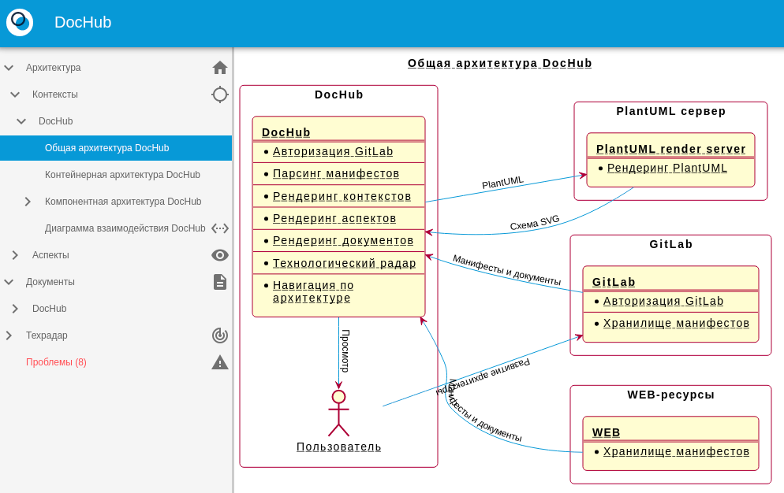
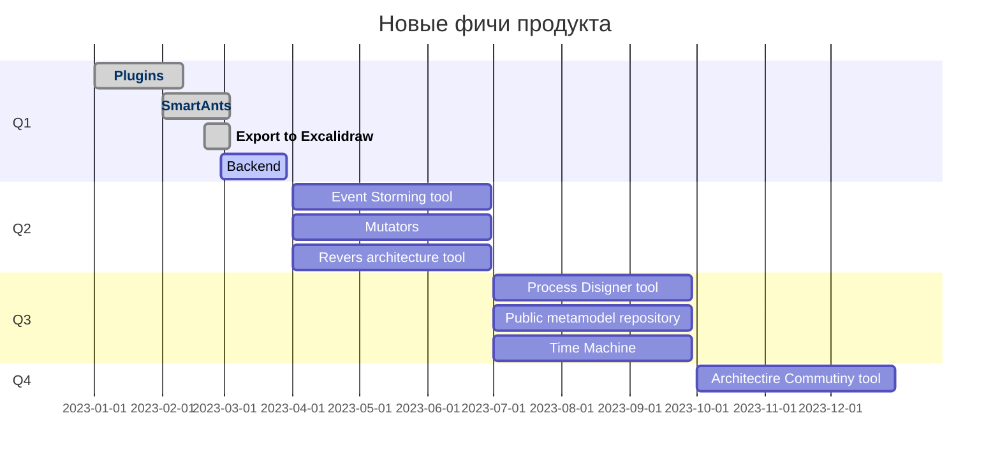
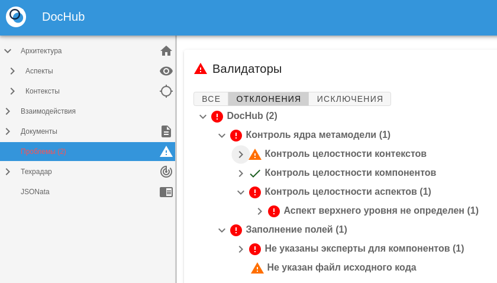
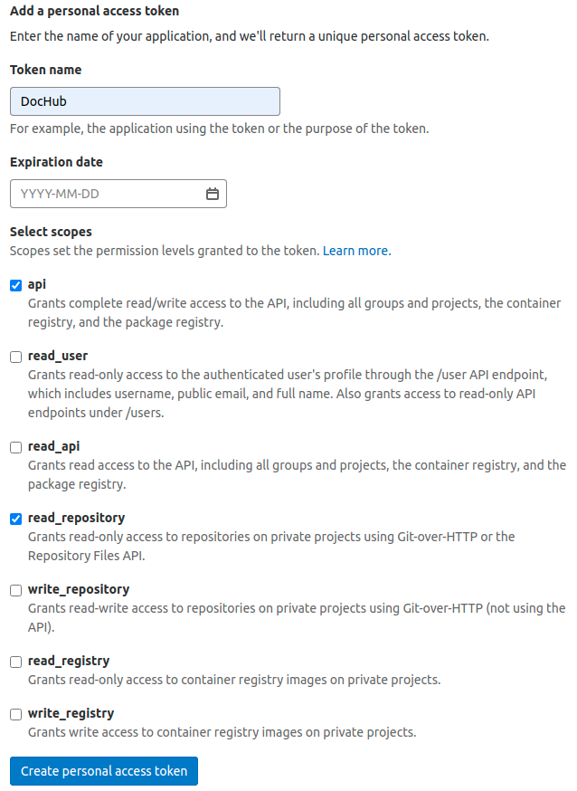
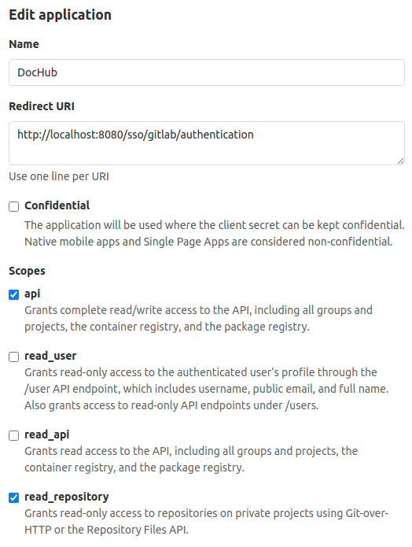

# DocHub



DocHub - инструмент описания архитектуры через код (Architecture as a code). Код архитектуры - ансамбль файлов на языках,
решающих задачу описания. Поддерживаются:

* [PlantUML](https://plantuml.com/) - позволяет создавать диаграммы, используя простой и интуитивно понятный язык;
* [Mermaid](https://mermaid-js.github.io/mermaid/#/) - позволяет создавать диаграммы с использованием кода;
* [Markdown](https://ru.wikipedia.org/wiki/Markdown) - язык разметки, созданный с целью обозначения форматирования в тексте;
* [Swagger](https://swagger.io/) - язык описания HTTP API контрактов;
* [AsyncAPI](https://www.asyncapi.com/) - язык описания событийных контрактов;
* [SmartAnts](https://dochub.info/docs/dochub.smartants) - продвинутый инструмент презентации архитектуры.
* [Манифесты](https://dochub.info/docs/dochub_contexts) - структурированные файлы в формате YAML/JSON для описания архитектурных объектов;

Решаемые проблемы:

* [Управление версиями](#versions);
* [Децентрализованное управление архитектурой в Agile-ориентированных компаниях](#decentralized);
* [Управление архитектурой экосистемы](#ecosystem);
* [Создание архитектурных фасадов (портал документации)](#facade);
* [Анализ архитектуры](#analysis);
* [Контроль консистентности](#problems);
* [Расширяемая матамодель](#extmetamodel).

## Быстрый старт

Рекомендую начать с прочтения статьи [Архитектра рядом с кодом](https://habr.com/ru/post/659595/).
Познакомиться с работой инструмента и его подробной документацией можно на сайте 
[https://dochub.info](https://dochub.info/). 
Примеры использования можно найти в специальном репозитории, который развивает 
сообщество - [Примеры DocHub](https://github.com/rpiontik/DocHubExamples)

Вступайте в сообщество [DocHubTeam](https://t.me/archascode). Здесь мы
обсуждаем подход "Архитектура как код" и опыт применения DocHub.

## План развития



***ВНИМАНИЕ!*** [Принципы развития продукта](#manifest)

## <a name="versions"></a> Управление версиями архитектуры

DocHub позволяет развивать кодовую базу архитектуры аналогично кодовой базе приложений. В качестве системы управления
версиями используется GitLab.


## <a name="decentralized"></a> Децентрализованное управление архитектурой в Agile-ориентированных компаниях

DocHub умеет консолидировать описание архитектуры из различных источников. Например, из разных репозиториев. Это
позволяет командам действовать независимо в сотрудничестве друг с другом.


## <a name="ecosystem"></a> Управление архитектурой экосистем

DocHub создан с учетом современных проблем в управлении архитектурой экосистемы. В ней продукты взаимосвязаны,
но развиваются автономно. DocHub позволяет создать единое информационное пространство для экосистемы. Стимулирует
положительную синергию продуктов.


## <a name="facade"></a> Архитектурные фасады

DocHub хорошо решает задачу публичного портала документации.


[Пример портала](https://dochub.info/).


## <a name="analysis"></a> Анализ архитектуры

Один из ключевых принципов инструмента - Архитектура как данные. Это означает, что вы можете
получать ценные для себя сведения из архитектуры, используя язык запросов [JSONata](https://jsonata.org/).

Протейшим примером этого подхода являются [табличные документы](https://dochub.info/docs/dochub.tables).


## <a name="problems"></a> Контроль консистентности архитектуры

DocHub умеет находить проблемы в описании архитектуры и контролировать определенные вами правила.



## <a name="extmetamodel"></a> Расширяемая матамодель

Матемодель DocHub может быть расширена по вашему желанию. Есть возможность как модифицировать
уже существующие сущности, так и создавать собственные.

Познакомиться с идеей ближе можно в статье [Код архитектуры — это жидкость](https://habr.com/ru/post/701050/).

Пример можно посмотреть [здесь](https://github.com/rpiontik/DocHubExamples/tree/main/src/C4Model)


## Развертывание

### Конфигурирование

Определите необходимые переменные окружения. Используйте файл примера [example.env](example.env) для этого. Переименуйте его для
продакшен окружения в ".env" для локального развертывания в ".env".

Если вы ничего не будете трогать, развертывание произойдет с дефолтными настройками. В этом случае DocHub будет
содержать собственную документацию.

### Локальное развертывание

Выполните команды:
```
docker-compose up --build
```
DocHub станет доступен по адресу [http://localhost:8080/main](http://localhost:8080/main)

### Сборка из исходников для продакшен

Проект является VueJS SPA приложением. В качестве backend пользуется GitLab.

Для развёртывания потребуется стандартная сборка VueJS приложения средствами npm, версией не ниже 8.1.х (версия node 16.х.х).
```
npm сi
npm run build
```

В результате будут сгенерированы статические файлы в папке /dist. Их необходимо
опубликовать используя web-сервер. Например, nginx.

Подробнее о вариантах развертывания можно узнать [тут](https://cli.vuejs.org/ru/guide/deployment.html).

## Интеграция с GitLab
### Для локального развертывания
В файле "example" укажите адрес GitLab в соответствующей переменной:
```
VUE_APP_DOCHUB_GITLAB_URL=https://foo.space
```

В GitLab **под своей учетной записью** выпустите персональный токен Profile->Preferences->Access Tokens



Полученный токен укажите в файле ".env" в переменной:
```
# Персональный токен gitlab. Используется для локальной разработки
VUE_APP_DOCHUB_PERSONAL_TOKEN=9H...FR
```

Перезапустите контейнеры:
```
docker-compose down
docker-compose up --build
```

### Локальное развитие архитектуры

Создайте папку "/public/workspace". Папка входит в .gitignore. Это нормально. Папка предназначена для
локального развертывания архитектурных репозиториев. Клонируйте необходимый архитектурный репозиторий.

```
cd /public/workspace
git clone git@git.foo.space:repo.git
```

Определите в ".env" переменную корневого манифеста:

```
VUE_APP_DOCHUB_ROOT_MANIFEST=workspace/repo/root.yaml
``` 

Перезапустите контейнеры:

```
docker-compose down
docker-compose up --build
```

Теперь вы можете вносить изменения в репозиторий локально и видеть результат изменений в режиме реального времени.

### Для продакшена
В файле ".env" укажите адрес GitLab в соответствующей переменной:
```
VUE_APP_DOCHUB_GITLAB_URL=https://foo.space
```

Настройте OAuth2 service provider в GitLab. Документацию по настройке можно найти на
[официальном сайте](https://docs.gitlab.com/ee/integration/oauth_provider.html).



Полученные токены укажите в файле .env в переменных:
```
# Идентификатор приложения зарегистрированного в GitLab
VUE_APP_DOCHUB_APP_ID=5f3...f0

# Секрет приложения
VUE_APP_DOCHUB_CLIENT_SECRET=1e4...384
```

Соберите приложение:
```
npm run build
```

# <a name="manifest"></a> Принципы развития продукта

## Термины
***Наш клиент*** - организация или лицо ее представляющее, которые ***действительно*** используют продукт или
***действительно*** собираются его использовать.

***Наше комьюнити*** - сообщество полностью или частично разделяющее идею продукта.

## Принципы

1. Команда продукта работает по принципам Agile. Причина этому не дань "модным тенденциям", а искренняя вера
в то, что только мотивированные члены команды могут достичь действительно значимых результатов.

2. Мы отдаем предпочтение работающему продукту, а не исчерпывающей документации. Документация очень важна, но ровно в
необходимом объеме.

3. Развитие продукта идет в тесной связи с клиентом. Наша задача не соблюсти контракт с ним, а сделать его счастливым.
Решить не только его сегодняшние проблемы, но и перспективные. 

4. Мы хорошо понимаем, что наш продукт развивается в динамичном мире. Наша команда постоянно переоценивает свои цели и
адекватность средств их достижения.

5. Мы в крайней степени дорожим вкладом сообщества в продукт. Такой вклад обязательно будет поддержан. 
Контрибьютор получит всестороннюю помощь успешной интеграции его вклада в продукт. Его вклад будет публично заявлен. 
Одновременно с этим, команда продукта несет ответственность за стратегическое развитие продукта перед клиентом.
За его образ и целостность во всех аспектах. Эта ответственность дает ей право финального решения об образе продукта,
его функциональной наполненности и порядке выхода фич.

## Отказ от обязательств в строгом планировании

По этой причине, наши опубликованные планы, это планы в который мы искренне верим сегодня. Но они является лишь инструментом координации команды и комьюнити продукта. Они могут пересматриваться в любой момент, когда станет
очевидным, что они устарели.

Следите за новостями в [группе комьюнити](https://t.me/archascode) и нашем [канале](https://t.me/dochubchannel).

# Статьи
* [Архитектура как кот VS Архитектура как кол](https://habr.com/ru/company/rabota/blog/578340/);
* [Архитектура как данные](https://habr.com/ru/post/593009/);
* [Архитектура рядом с кодом](https://habr.com/ru/post/659595/);
* [Код архитектуры — это жидкость](https://habr.com/ru/post/701050/);
* [Кто последний на индустриальный стандарт? Мне только спросить…](https://habr.com/ru/post/713534/);

# Сообщество

* [DocHubTeam](https://t.me/archascode)

# Лицензия
DocHub распространяется под лицензией Apache License 2.0 Open source license.
